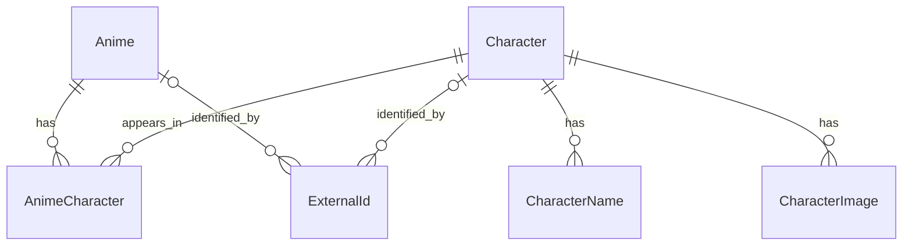

# Data Sources & Data Model

This document describes the initial data strategy and data model decisions for AniCharaDB.

The goal is not to reproduce an existing anime database, but to build an independent and extensible character database capable of aggregating data from multiple sources over time.

## 1. Data Source Strategy

AniCharaDB is designed around a multi-source architecture.

Rather than depending structurally on a single external database, AniCharaDB maintains its own internal entities and uses external sources to populate, enrich, and cross-reference them.

### Primary Source — AniList

AniList will be used as the primary ingestion source during the first development phase.

It provides structured access to:

- Anime
- Characters
- Anime–character relationships
- Character roles
- Alternative titles
- Images
- Character metadata
- Voice actors
- MyAnimeList identifiers for many anime

Its GraphQL API also makes it possible to efficiently navigate relationships between anime and characters.

For the initial version of AniCharaDB:

```text
AniList → Primary ingestion source
```

AniList identifiers will be stored as external identifiers and will **not** become AniCharaDB's internal identifiers.

---

## 2. Secondary Sources

Additional sources may later be used to enrich the database.

### MyAnimeList / Jikan

Jikan provides access to public MyAnimeList data through an API.

It may be used to:

- enrich existing entities;
- recover information missing from AniList;
- cross-reference AniList and MyAnimeList entities;
- increase coverage.

Whenever possible, existing AniList → MyAnimeList mappings should be used before attempting automatic entity matching.

### Wikidata

Wikidata can provide another layer of entity resolution and external identifiers.

It may help connect AniCharaDB entities with identifiers from platforms such as:

```text
AniList
MyAnimeList
AniDB
Kitsu
Anime-Planet
Anime News Network
...
```

Wikidata is therefore considered primarily as a future **cross-reference and enrichment source**, rather than the initial ingestion source.

### Future Sources

The architecture should allow additional sources to be integrated without modifying the core identity of existing AniCharaDB entities.

Potential sources include:

```text
AniDB
Kitsu
Anime-Planet
Anime News Network
Wikidata
Other anime databases
```

The relevance, accessibility, licensing constraints, and data quality of each source will be evaluated before integration.

---

## 3. General Architecture

The initial ingestion strategy can be represented as:

```text
                  ┌──────────────┐
                  │   AniList    │
                  │ PRIMARY DATA │
                  └──────┬───────┘
                         │
                         ▼
                ┌────────────────┐
                │   AniCharaDB   │
                │ Canonical Data │
                └───────┬────────┘
                        │
             ┌──────────┼──────────┐
             ▼          ▼          ▼
          Jikan      Wikidata    Future
           /MAL                    Sources
             │          │
             ▼          ▼
        Enrichment   ID Mapping
```

AniCharaDB remains the canonical representation.

External databases are considered **data providers**, not the source of AniCharaDB's internal identity.

---

## 4. Core Entities

The initial model revolves around two primary entities:

```text
Anime
Character
```

These entities have a many-to-many relationship.

An anime can contain many characters.

A character can appear in many anime.

This relationship therefore requires an intermediate entity:

```text
Anime
   │
   ▼
AnimeCharacter
   │
   ▼
Character
```

---

## 5. Anime

Initial conceptual representation:

```text
ANIME
─────
id
title
title_english
title_native
format
status
episodes
start_date
end_date
image_url
```

`id` represents an internal AniCharaDB identifier.

External identifiers such as AniList or MyAnimeList IDs must not be used as primary database identifiers.

---

## 6. Character

The Character core distinguishes stable internal identity and normalized attributes from source-dependent or potentially conflicting information. Names and images are modeled separately so that multiple representations can coexist. Including an attribute in the core does not mean that every source agrees on its value.

Current conceptual direction:

```text
CHARACTER
─────────
id
gender

birth_year       nullable
birth_month      nullable
birth_day        nullable

created_at
updated_at
```

The timestamps describe the lifecycle of the AniCharaDB record. They do not, by themselves, identify the source of an imported value.

Names and images remain separate from the core, as previously decided. This refinement replaces the single `date_of_birth` field with partial birth-date components and moves `description` out of the core sketch into the broader source-dependent data discussion below. This is a **conceptual model**, not a final SQL or physical database schema, and the field list is not permanently finalized.

### Partial Dates of Birth

A fictional character's birthday may be known without a birth year, or only a month may be available. A single standard `DATE` value cannot express that uncertainty without supplying missing components.

The year, month, and day should therefore be independently nullable. For example:

```text
birth_year  = null
birth_month = 10
birth_day   = 10
```

Or, when only the month is known:

```text
birth_year  = null
birth_month = 10
birth_day   = null
```

AniCharaDB should preserve partial information rather than invent a year or day to construct a complete date. Validation of partial dates and the final database representation remain open; this decision does not prescribe SQL types or constraints.

### Gender

Gender should be a nullable value that can be normalized from external sources, rather than a boolean such as `is_male = true`. A boolean cannot adequately represent known values, explicitly unknown values, missing information, and source values that still require normalization.

The conceptual direction allows those cases without establishing a final enum. The vocabulary, normalization rules, and representation of explicitly unknown versus missing information still need to be designed. Conflicting source values must not be resolved merely by overwriting the current value.

### Character Names

A character may have multiple names, spellings, aliases, nicknames, native names, or translations. Each name should be represented separately:

```text
CHARACTER_NAME
--------------
id
character_id
name
type
language
```

Potential name types include:

```text
PRIMARY
NATIVE
ALIAS
NICKNAME
ALTERNATIVE
```

These types are provisional, not a final enum. Language representation and rules for selecting a primary name still need to be defined.

CharacterName supports an arbitrary number of names for each character. Fields such as `alternative_name_1`, `alternative_name_2`, and `alternative_name_3` impose a fixed limit and require structural changes whenever more names are needed. Separate name records also allow each name to carry its own type and language.

Conceptually:

```text
Character: Naruto Uzumaki
│
├── Naruto Uzumaki
│   type = PRIMARY
│
├── うずまきナルト
│   type = NATIVE
│
└── Number One Hyperactive Knucklehead Ninja
    type = ALIAS
```

### Character Images

Different providers may supply different images of the same character. Images should therefore be represented separately from the Character core:

```text
CHARACTER_IMAGE
---------------
id
character_id
url
source
is_primary
```

This allows AniCharaDB to retain images from multiple providers while selecting one as the primary representation when necessary. The selection policy and how `source` is represented remain open. An image's source alone does not resolve provenance for other character attributes.

### Source-Dependent Attributes

Descriptions, age, height, and weight should not currently be treated as unquestionable canonical Character fields.

**Description:** Different sources may provide different descriptions of the same character:

```text
Character
│
├── AniList description
├── MyAnimeList description
└── other source description
```

AniCharaDB should eventually retain where each description came from instead of blindly overwriting one description with another. This supersedes the earlier single core `description` field. The representation of descriptions is part of the broader provenance problem; no description or provenance table is defined yet.

**Age:** A character may have different ages in different anime entries or at different points in a story:

```text
Character
├── age during Anime A
├── age during Anime B
└── age during later story arc
```

Age is therefore not currently a simple canonical Character field. It requires a later model that can account for story context and source provenance. That model remains open.

**Height and weight:** These values may change during the story, differ between sources, or be unknown. They may require both context and provenance, so their final representation remains open rather than being established as canonical core attributes.

The conceptual distinction is:

```text
Character
│
├── Core identity / normalized attributes
│
├── CharacterName[]
├── CharacterImage[]
├── ExternalId[]
│
└── Source-dependent data
    ├── descriptions
    ├── age
    ├── height
    ├── weight
    └── future attributes
```

This separates responsibilities conceptually; it does not introduce a storage structure for source-dependent data.

### Data Provenance — Open Decision

> Data received from an external API must not automatically be treated as the canonical truth of AniCharaDB.

As a multi-source database, AniCharaDB should likely retain the provenance of imported values. If AniList supplies one value and MyAnimeList supplies another, the system should eventually be able to determine which source supplied each value, even when a canonical value is selected.

This applies to source-dependent descriptions and contextual attributes as well as conflicting values for normalized core attributes. AniList's role as the initial ingestion source does not establish an automatic precedence policy for every value.

This will be important for:

- conflict resolution;
- entity merging;
- data quality;
- debugging ingestion;
- refreshing data;
- determining which source should take precedence.

External identifiers link entities across providers, but do not identify the origin of every attribute value. The granularity of provenance, how competing values and their history are retained, and how source precedence is decided still need to be designed. No final provenance storage model or conflict-resolution implementation has been chosen.

---

## 7. Anime–Character Relationship

The relationship between an anime and a character contains information of its own.

Initial representation:

```text
ANIME_CHARACTER
───────────────
anime_id
character_id
role
```

For example:

```text
Naruto Uzumaki
│
├── Naruto
│   └── role = MAIN
│
├── Naruto Shippuden
│   └── role = MAIN
│
└── Boruto
    └── role = SUPPORTING
```

For this reason, `role` belongs to the Anime–Character relationship rather than directly to the Character entity.

---

## 8. External Identifiers

AniCharaDB must remain independent from external database identifiers.

Instead of:

```text
Character
id = AniList character ID
```

AniCharaDB should use:

```text
Character
id = AniCharaDB internal ID
```

External identifiers are stored separately.

Conceptually:

```text
EXTERNAL_ID
───────────
entity_type
entity_id
source
external_id
```

Example:

```text
Character: Naruto Uzumaki

AniCharaDB ID → internal identifier
AniList       → external identifier
MyAnimeList   → external identifier
Wikidata      → external identifier
AniDB         → external identifier
...
```

This allows AniCharaDB to integrate multiple databases without becoming dependent on any single one.

---

## 9. Entity Resolution

One of the long-term challenges of AniCharaDB will be determining whether entities originating from different sources represent the same anime or character.

For example:

```text
AniList Character #X
        +
MAL Character #Y
        +
Wikidata Entity #Z
        │
        ▼
One AniCharaDB Character
```

During the initial development phase, AniList will act as the primary source of entities.

Known mappings such as AniList → MyAnimeList should be preferred over heuristic matching.

More advanced deduplication and entity-resolution mechanisms can be introduced later.

---

## 10. Initial Data Model

The current conceptual relationships are:



AnimeCharacter carries the role for each anime appearance. CharacterName and CharacterImage allow multiple representations without adding repeated fields to Character.

The relationships remain unchanged by the refined Character attributes. Partial birth dates and nullable gender are described in the Character section. Source-dependent descriptions, age, height, and weight are intentionally not shown as additional entities: their contextual and provenance models have not yet been designed.

Each ExternalId refers to one internal entity, selected conceptually by `entity_type` and `entity_id`: Anime or Character in the current model, not both. The two optional links show these alternative targets; the diagram does not encode their mutual exclusivity or prescribe physical foreign keys.

This is a **conceptual model**, not the final database schema. Field sketches are documented in the entity sections above. The diagram does not define database types, required minimum counts, uniqueness constraints, or a provenance implementation.

---

## 11. Current Decisions

The following decisions are currently established:

- AniList is the initial primary ingestion source.
- AniCharaDB owns its internal entity identifiers.
- External IDs are stored separately.
- Anime and Character have a many-to-many relationship.
- Character role belongs to the Anime–Character relationship.
- The Character core separates internal identity, normalized attributes, and record timestamps from names, images, and source-dependent data; its field list remains provisional.
- Partial birth dates use independently nullable year, month, and day components conceptually, without inventing missing information.
- Gender is nullable and normalizable, not a boolean; no final enum is established.
- Descriptions require source provenance, while age, height, and weight may also require story context; their final representations remain open.
- External API values are not automatically canonical truth, including when supplied by the initial primary source.
- CharacterName supports an arbitrary number of names, with a type and language for each name; the name types remain provisional.
- CharacterImage retains images from different sources and allows a primary representation to be selected; selection rules remain open.
- Secondary sources will enrich existing data progressively.
- Cross-source entity resolution will be introduced incrementally.
- The internal model must remain independent from the schema of any external API.

## 12. Open Day 1 Questions

The separation of Character, CharacterName, and CharacterImage establishes the current conceptual direction. Further decisions are needed before a physical schema or implementation can be defined:

- Which additional attributes belong in the Character core, and how should conflicting source values become normalized values?
- How should partial birth dates be validated and ultimately represented in the database?
- What gender vocabulary and normalization rules are appropriate, and how should explicitly unknown values differ from missing information?
- How should descriptions retain their source provenance, and how should age, height, and weight retain relevant story context and provenance?
- What are the final name types, language conventions, and primary-name selection rules?
- How should image sources be represented, and how should the primary image be selected?
- How should value provenance, competing values, and source precedence be modeled, including during refreshes?
- How should full cross-source merging and deduplication work beyond known external-ID mappings?
- How should voice actors and other planned entities relate to characters and anime?
- What are the limitations, coverage, reliability, and licensing constraints of each source before integration?
- Which database and ingestion technologies should be selected, and what should the API and synchronization architecture be?

Database selection remains open. These conceptual decisions do not establish a final physical schema, migrations, or application implementation.
